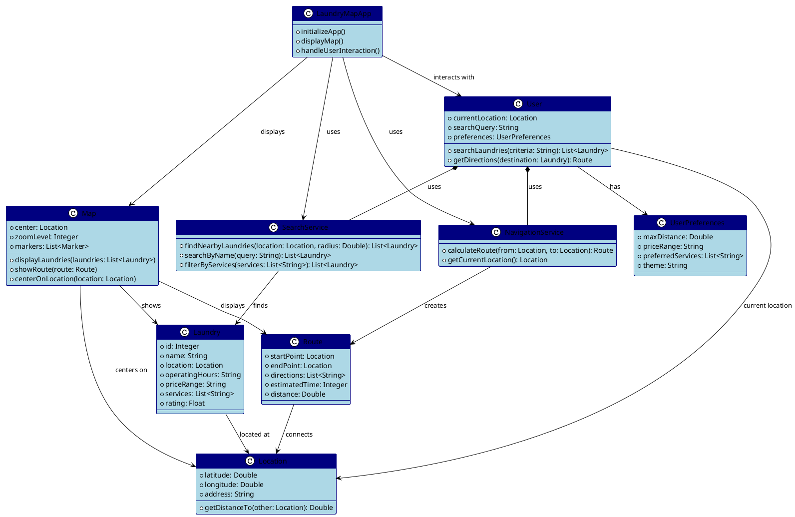

# LaundryMap Class Diagram (Conceptual Design)

## Class Diagram Overview

This simplified class diagram shows the **core domain concepts** for the LaundryMap project during the initial design phase.

### Core Domain Classes

#### LaundryMapApp
- **Purpose**: Main application controller
- **Responsibility**: Coordinate user interactions and system components
- **Role**: Entry point and orchestrator

#### Laundry
- **Purpose**: Core business entity representing a laundry service
- **Responsibility**: Store laundry location and service information
- **Role**: Primary data model

#### Location
- **Purpose**: Geographic position and address information
- **Responsibility**: Handle spatial calculations and location data
- **Role**: Supporting data model for geographic operations

#### User
- **Purpose**: Represent application user and their context
- **Responsibility**: Manage user state, preferences, and interactions
- **Role**: User context management

### Supporting Classes

#### UserPreferences
- **Purpose**: Store user's customization settings
- **Responsibility**: Maintain user preferences and settings
- **Role**: Configuration management

#### Map
- **Purpose**: Visual representation and interaction with geographic data
- **Responsibility**: Display laundries, routes, and user interface
- **Role**: Presentation layer for geographic data

#### Route
- **Purpose**: Navigation path between two locations
- **Responsibility**: Store direction information and travel estimates
- **Role**: Navigation data model

### Service Classes

#### SearchService
- **Purpose**: Handle laundry discovery and filtering
- **Responsibility**: Implement search algorithms and filtering logic
- **Role**: Business logic for discovery features

#### NavigationService
- **Purpose**: Provide routing and location services
- **Responsibility**: Calculate routes and manage geolocation
- **Role**: Geographic and navigation operations

## Design Principles

### 1. **Domain-Driven Design**
- Classes represent real-world concepts (Laundry, User, Location)
- Clear separation between domain models and services
- Business logic encapsulated in appropriate classes

### 2. **Single Responsibility**
- Each class has one clear purpose
- Services handle specific business operations
- Data models focus on data representation

### 3. **Loose Coupling**
- Classes interact through well-defined interfaces
- Services can be implemented independently
- Easy to modify or extend individual components

### 4. **Simple Relationships**
- Clear composition and association relationships
- No complex inheritance hierarchies
- Straightforward dependencies

This conceptual design provides a foundation for implementation while remaining simple enough for project planning and team communication.