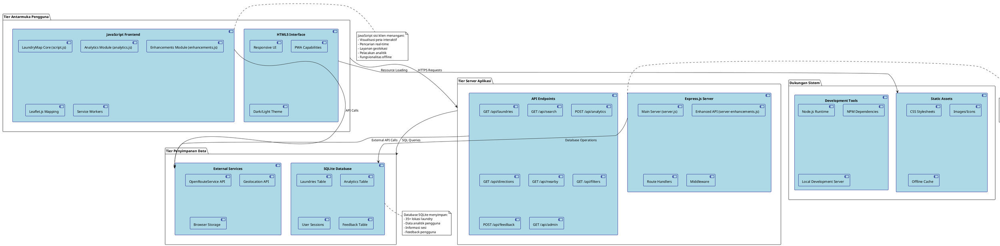

# Diagram Arsitektur LaundryMap

## Gambaran Umum Arsitektur

Aplikasi LaundryMap menggunakan arsitektur 3-tier yang terdiri dari:

### 1. Tier Antarmuka Pengguna (Frontend)
- **HTML5 Interface**: Tampilan web responsif dengan kemampuan PWA
- **JavaScript Frontend**: Logika sisi klien yang modular dengan fitur pemetaan
- **Leaflet.js**: Peta interaktif dan operasi geospasial

### 2. Tier Server Aplikasi (Backend)
- **Express.js Server**: Server API RESTful untuk logika bisnis
- **API Endpoints**: 8+ endpoint untuk data laundry, pencarian, dan analitik
- **Middleware**: Pemrosesan request, CORS, dan serving file statis

### 3. Tier Penyimpanan Data (Database)
- **SQLite Database**: Database ringan untuk data laundry dan analitik
- **External APIs**: Integrasi dengan OpenRouteService untuk navigasi
- **Browser Storage**: Cache di browser untuk mode offline

### Prinsip Arsitektur Utama
- **Separation of Concerns**: Pemisahan jelas antara tampilan, logika bisnis, dan data
- **RESTful Design**: API stateless mengikuti standar REST
- **Progressive Web App**: Pendekatan offline-first dengan service workers
- **Modular Frontend**: Modul terpisah untuk fitur inti, analitik, dan enhancement