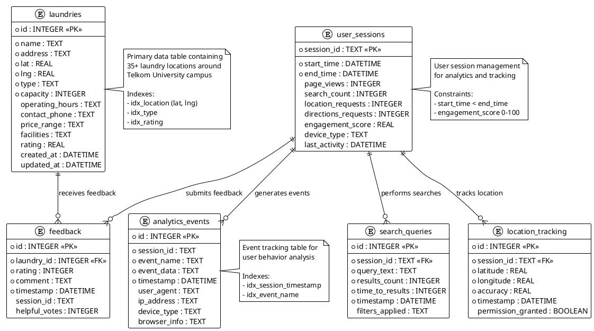

# LaundryMap Database Schema

## Database Schema Overview

The LaundryMap database uses SQLite and consists of 6 main tables:

### Core Tables

#### 1. laundries
- **Purpose**: Stores laundry location data
- **Key Features**: Geospatial coordinates, facility information, ratings
- **Size**: 35+ records covering Telkom University area

#### 2. analytics_events
- **Purpose**: Tracks user interactions and behavior
- **Key Features**: Event-based tracking, session correlation
- **Data Types**: Page views, searches, clicks, errors

#### 3. user_sessions
- **Purpose**: Manages user session data
- **Key Features**: Session duration, engagement metrics
- **Analytics**: Used for dashboard insights

### Supporting Tables

#### 4. feedback
- **Purpose**: User reviews and ratings for laundries
- **Key Features**: Rating system, comment storage
- **Relationship**: Links to specific laundries

#### 5. search_queries
- **Purpose**: Search behavior analysis
- **Key Features**: Query text, performance metrics
- **Analytics**: Search effectiveness tracking

#### 6. location_tracking
- **Purpose**: Geolocation usage patterns
- **Key Features**: GPS coordinates, accuracy data
- **Privacy**: Anonymous session-based tracking

### Key Database Features
- **Lightweight**: SQLite for simple deployment
- **Indexed**: Optimized for location-based queries
- **Analytics-Ready**: Structured for dashboard reporting
- **Privacy-Focused**: No personal data storage