# LaundryMap API Endpoints

```plantuml
@startuml LaundryMapAPIEndpoints

!theme plain
skinparam backgroundColor White
skinparam componentBackgroundColor LightBlue
skinparam componentBorderColor Navy
skinparam interfaceBackgroundColor LightGreen
skinparam interfaceBorderColor DarkGreen

' API Gateway
component "Express.js API Server" as server {
  
  interface "GET /api/laundries" as getLaundries
  note right of getLaundries
    Returns all laundry locations
    Response: Array of laundry objects
    Fields: id, name, address, lat, lng, type, etc.
  end note
  
  interface "GET /api/search?q={query}" as search
  note right of search
    Search laundries by name/address
    Parameters: q (query string)
    Response: Filtered laundry array
    Features: Fuzzy matching, relevance scoring
  end note
  
  interface "GET /api/nearby?lat={lat}&lng={lng}&radius={r}" as nearby
  note right of nearby
    Find laundries within radius
    Parameters: lat, lng, radius (optional)
    Response: Distance-sorted laundry array
    Algorithm: Haversine distance calculation
  end note
  
  interface "GET /api/directions" as directions
  note right of directions
    Get route to laundry
    Parameters: fromLat, fromLng, toLat, toLng
    Response: Route geometry and instructions
    Provider: OpenRouteService API
  end note
  
  interface "POST /api/analytics" as analytics
  note right of analytics
    Track user events
    Body: {eventName, eventData, sessionId}
    Response: Success confirmation
    Storage: SQLite analytics table
  end note
  
  interface "GET /api/filters" as filters
  note right of filters
    Get available filter options
    Response: {types, capacities, facilities}
    Dynamic: Based on current data
  end note
  
  interface "POST /api/feedback" as feedback
  note right of feedback
    Submit laundry feedback
    Body: {laundryId, rating, comment}
    Response: Feedback ID
    Validation: Rating 1-5, optional comment
  end note
  
  interface "GET /api/admin/dashboard" as admin
  note right of admin
    Admin analytics dashboard
    Auth: Admin session required
    Response: Aggregated metrics
    Features: Charts, insights, export
  end note
}

' Client applications
component "Web Frontend" as frontend
component "Mobile Browser" as mobile
component "Admin Panel" as adminPanel

' HTTP Methods and Status Codes
note top of server
  **HTTP Status Codes:**
  200 - OK (Successful requests)
  400 - Bad Request (Invalid parameters)
  404 - Not Found (Resource not exists)
  500 - Internal Server Error
  
  **Request/Response Format:** JSON
  **CORS:** Enabled for all origins
  **Rate Limiting:** Not implemented
end note

' Connections
frontend --> getLaundries : "GET"
frontend --> search : "GET"
frontend --> nearby : "GET"
frontend --> directions : "GET"
frontend --> analytics : "POST"
frontend --> filters : "GET"
frontend --> feedback : "POST"

mobile --> getLaundries : "GET"
mobile --> search : "GET"
mobile --> nearby : "GET"
mobile --> analytics : "POST"

adminPanel --> admin : "GET"
adminPanel --> analytics : "GET"

' External dependencies
component "OpenRouteService API" as ors
component "SQLite Database" as db

directions --> ors : "External API Call"
server --> db : "Database Queries"

@enduml
```

## API Endpoints Documentation

The LaundryMap API provides 8 main endpoints for frontend interaction:

### Core Data Endpoints

#### GET /api/laundries
- **Purpose**: Retrieve all laundry locations
- **Response**: Complete laundry dataset (35+ locations)
- **Use Case**: Initial map population, complete listings

#### GET /api/search
- **Purpose**: Text-based laundry search
- **Parameters**: `q` (query string)
- **Features**: Fuzzy matching, name/address search
- **Use Case**: Real-time search functionality

#### GET /api/nearby
- **Purpose**: Geospatial proximity search
- **Parameters**: `lat`, `lng`, `radius` (optional, default 5km)
- **Algorithm**: Haversine distance calculation
- **Use Case**: Location-based recommendations

### Feature Endpoints

#### GET /api/directions
- **Purpose**: Route planning and navigation
- **Parameters**: `fromLat`, `fromLng`, `toLat`, `toLng`
- **Provider**: OpenRouteService API integration
- **Use Case**: Turn-by-turn directions to laundries

#### POST /api/analytics
- **Purpose**: User behavior tracking
- **Body**: Event data (name, data, sessionId)
- **Storage**: SQLite analytics table
- **Use Case**: Usage analytics and insights

#### GET /api/filters
- **Purpose**: Dynamic filter options
- **Response**: Available types, capacities, facilities
- **Features**: Based on current data
- **Use Case**: Search filtering interface

### User Interaction Endpoints

#### POST /api/feedback
- **Purpose**: User reviews and ratings
- **Body**: Laundry ID, rating (1-5), optional comment
- **Validation**: Rating range, sanitized comments
- **Use Case**: Community feedback system

#### GET /api/admin/dashboard
- **Purpose**: Administrative analytics
- **Authentication**: Admin session required
- **Response**: Aggregated metrics and insights
- **Use Case**: Business intelligence dashboard

### API Characteristics
- **Format**: JSON request/response
- **CORS**: Enabled for all origins
- **Error Handling**: Standardized HTTP status codes
- **Performance**: Lightweight SQLite backend
- **Security**: Input validation, SQL injection protection