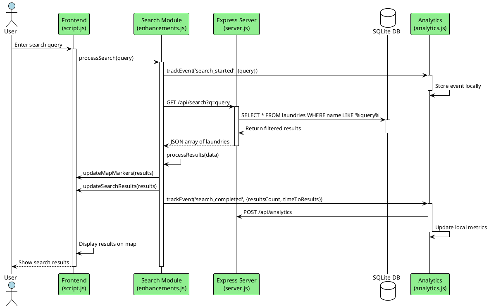
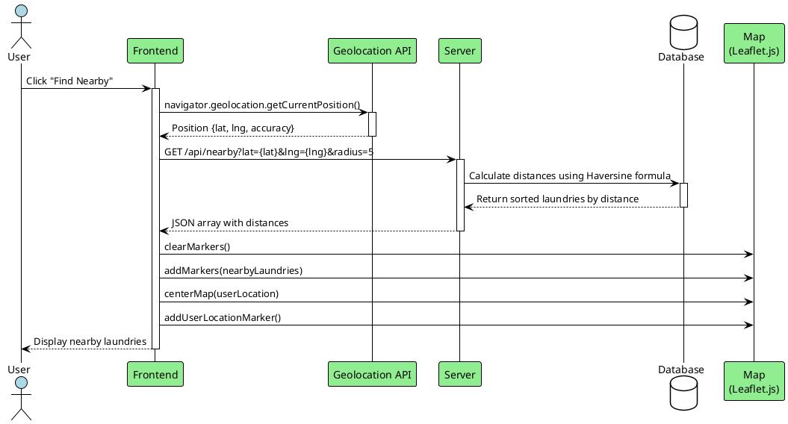
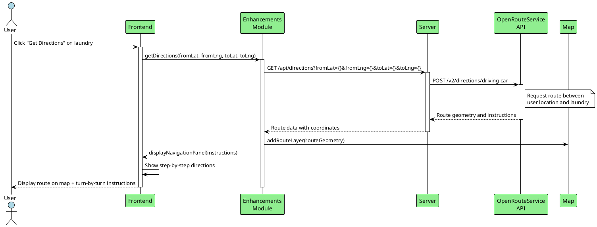
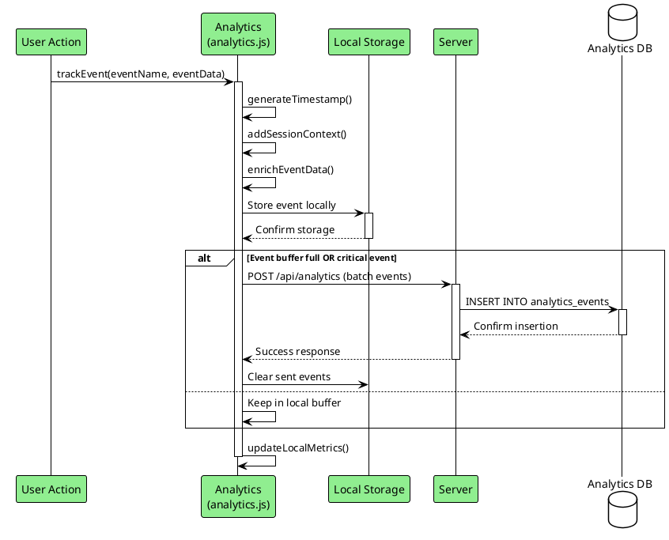
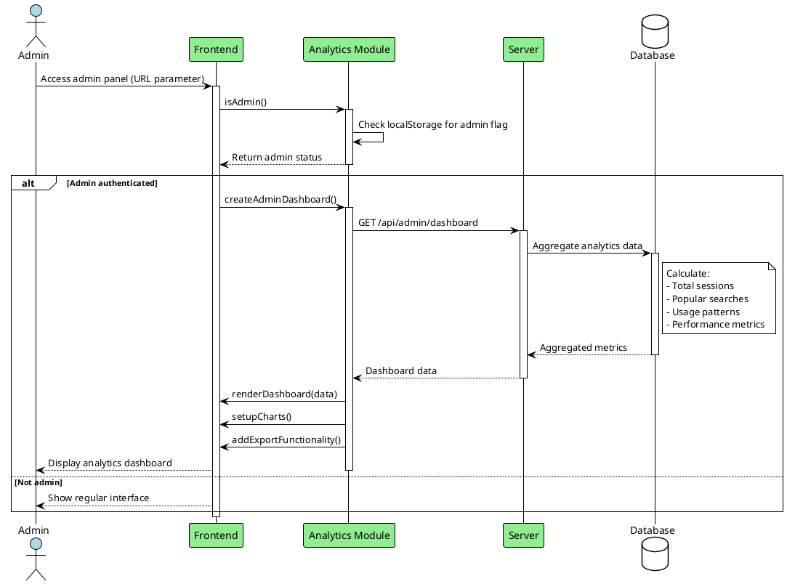

# LaundryMap Sequence Diagrams

## 1. User Search Flow

## 2. Location-Based Discovery

## 3. Directions and Navigation

## 4. Analytics Event Tracking

## 5. Admin Dashboard Access

## Sequence Diagrams Overview

These sequence diagrams illustrate the key user interactions and system flows in the LaundryMap application:

### 1. User Search Flow
- Real-time search with autocomplete
- Analytics tracking for search behavior
- Results display on interactive map

### 2. Location-Based Discovery
- Geolocation API integration
- Distance calculation using Haversine formula
- Proximity-based laundry recommendations

### 3. Directions and Navigation
- Integration with OpenRouteService API
- Route visualization on map
- Turn-by-turn navigation instructions

### 4. Analytics Event Tracking
- Client-side event buffering
- Batch transmission to server
- Local storage for offline capability

### 5. Admin Dashboard Access
- Role-based access control
- Real-time analytics aggregation
- Data visualization and export functionality

Each sequence demonstrates the separation between frontend logic, server-side processing, and data persistence, following the application's three-tier architecture.