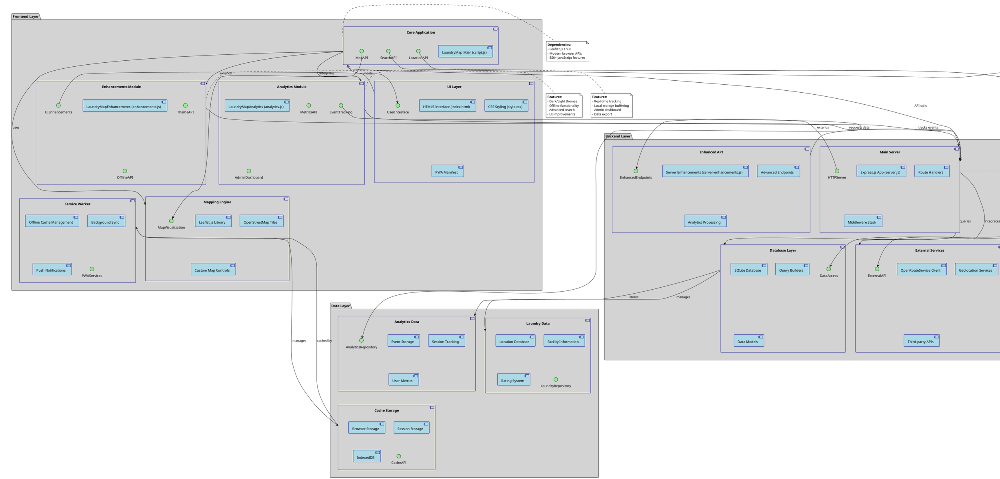

# LaundryMap Component Diagram

## Component Architecture Overview

The LaundryMap application is built using a modular component architecture with clear separation of concerns:

### Frontend Components

#### Core Application (`script.js`)
- **Purpose**: Main application logic and coordination
- **Responsibilities**: Map management, search functionality, user interactions
- **Dependencies**: Leaflet.js, browser APIs
- **Interfaces**: MapAPI, SearchAPI, LocationAPI

#### Analytics Module (`analytics.js`)
- **Purpose**: User behavior tracking and admin dashboard
- **Responsibilities**: Event collection, metrics calculation, dashboard visualization
- **Features**: Real-time tracking, local buffering, data export
- **Interfaces**: EventTracking, MetricsAPI, AdminDashboard

#### Enhancements Module (`enhancements.js`)
- **Purpose**: Advanced features and UI improvements
- **Responsibilities**: Theme management, offline functionality, enhanced search
- **Features**: Dark/light modes, PWA capabilities, advanced filters
- **Interfaces**: UIEnhancements, ThemeAPI, OfflineAPI

#### UI Layer
- **Purpose**: User interface presentation
- **Components**: HTML5 structure, CSS styling, PWA manifest
- **Features**: Responsive design, accessibility, progressive enhancement
- **Interface**: UserInterface

#### Mapping Engine
- **Purpose**: Interactive map visualization
- **Dependencies**: Leaflet.js, OpenStreetMap
- **Features**: Custom controls, marker management, route display
- **Interface**: MapVisualization

#### Service Worker
- **Purpose**: PWA functionality and offline support
- **Responsibilities**: Cache management, background sync, notifications
- **Features**: Offline-first approach, data synchronization
- **Interface**: PWAServices

### Backend Components

#### Main Server (`server.js`)
- **Purpose**: Core API server and request handling
- **Framework**: Express.js 4.x
- **Responsibilities**: Route handling, middleware, CORS, static files
- **Interface**: HTTPServer

#### Enhanced API (`server-enhancements.js`)
- **Purpose**: Advanced API endpoints and features
- **Responsibilities**: Analytics processing, admin endpoints, enhanced search
- **Features**: Data aggregation, admin authentication
- **Interface**: EnhancedEndpoints

#### Database Layer
- **Purpose**: Data persistence and query management
- **Technology**: SQLite3
- **Responsibilities**: CRUD operations, query optimization, data integrity
- **Interface**: DataAccess

#### External Services
- **Purpose**: Third-party API integration
- **Services**: OpenRouteService, geolocation APIs
- **Responsibilities**: Route calculation, geocoding, external data
- **Interface**: ExternalAPI

### Data Components

#### Laundry Data
- **Purpose**: Core business data storage
- **Contents**: 35+ laundry locations, facilities, ratings
- **Structure**: Geospatial data, metadata, user feedback
- **Interface**: LaundryRepository

#### Analytics Data
- **Purpose**: User behavior and application metrics
- **Contents**: Events, sessions, performance data
- **Features**: Real-time collection, historical analysis
- **Interface**: AnalyticsRepository

#### Cache Storage
- **Purpose**: Client-side data persistence
- **Technologies**: Browser storage, session storage, IndexedDB
- **Responsibilities**: Offline data, performance optimization
- **Interface**: CacheAPI

### Key Architectural Principles

1. **Separation of Concerns**: Each component has a single, well-defined responsibility
2. **Loose Coupling**: Components communicate through well-defined interfaces
3. **Progressive Enhancement**: Features degrade gracefully on older browsers
4. **Offline-First**: PWA capabilities ensure functionality without connectivity
5. **Modular Design**: Components can be developed and tested independently
6. **Performance Optimization**: Efficient data loading and caching strategies