# LaundryMap Deployment Diagram

```plantuml
@startuml LaundryMapDeployment

!theme plain
skinparam backgroundColor White
skinparam nodeBackgroundColor LightBlue
skinparam nodeBackgroundColor<<device>> LightGreen
skinparam nodeBackgroundColor<<server>> LightYellow
skinparam artifactBackgroundColor White
skinparam componentBackgroundColor LightCyan

' Client Devices
node "Student Mobile Device" <<device>> as mobile {
  component "Mobile Browser" as mobileBrowser {
    artifact "PWA App"
    artifact "Service Worker"
    artifact "Offline Cache"
  }
}

node "Student Laptop/Desktop" <<device>> as desktop {
  component "Web Browser" as webBrowser {
    artifact "LaundryMap Web App"
    artifact "Leaflet.js Maps"
    artifact "Local Storage"
  }
}

node "Admin Device" <<device>> as adminDevice {
  component "Admin Browser" as adminBrowser {
    artifact "LaundryMap Interface"
    artifact "Analytics Dashboard"
    artifact "Admin Tools"
  }
}

' Development Environment
node "Development Machine" <<server>> as devMachine {
  component "Node.js Runtime" as nodeRuntime {
    artifact "server.js"
    artifact "server-enhancements.js"
    artifact "package.json"
  }
  
  component "SQLite Database" as devDB {
    artifact "laundry.db"
    artifact "Test Data"
  }
  
  component "Static Files" as devStatic {
    artifact "public/index.html"
    artifact "public/script.js"
    artifact "public/analytics.js"
    artifact "public/enhancements.js"
    artifact "public/style.css"
  }
}

' Production Environment (Potential)
node "Production Server" <<server>> as prodServer {
  component "Web Server" as webServer {
    artifact "Express.js Application"
    artifact "Static File Server"
    artifact "API Endpoints"
  }
  
  component "Database Server" as prodDB {
    artifact "SQLite Production DB"
    artifact "Analytics Data"
    artifact "Backup Files"
  }
  
  component "File System" as fileSystem {
    artifact "Application Files"
    artifact "Log Files"
    artifact "Configuration"
  }
}

' External Services
cloud "External APIs" as externalAPIs {
  component "OpenRouteService" as ors {
    artifact "Routing API"
    artifact "Geocoding Service"
  }
  
  component "OpenStreetMap" as osm {
    artifact "Map Tiles"
    artifact "Geographic Data"
  }
  
  component "Browser APIs" as browserAPIs {
    artifact "Geolocation API"
    artifact "Storage APIs"
    artifact "Notification API"
  }
}

' Network Connections
mobile --> prodServer : "HTTPS/WiFi/Mobile Data"
desktop --> prodServer : "HTTPS/WiFi/Ethernet"
adminDevice --> prodServer : "HTTPS/Secure Connection"

devMachine --> externalAPIs : "API Calls (Development)"
prodServer --> externalAPIs : "API Calls (Production)"

mobile --> browserAPIs : "Native API Access"
desktop --> browserAPIs : "Browser API Access"
adminDevice --> browserAPIs : "Admin API Access"

' Development Deployment
note right of devMachine
  **Development Environment:**
  - Node.js v18+
  - Local SQLite database
  - Development server on localhost:3000
  - Live reload capabilities
  - Debug logging enabled
end note

' Production Deployment
note right of prodServer
  **Production Environment:**
  - Scalable web server (Express.js)
  - Production SQLite database
  - Static file caching
  - Error logging and monitoring
  - HTTPS encryption
end note

' Client Capabilities
note left of mobile
  **Mobile Features:**
  - Progressive Web App
  - Offline functionality
  - GPS location access
  - Touch-optimized interface
  - App-like experience
end note

note left of desktop
  **Desktop Features:**
  - Full-featured interface
  - Keyboard shortcuts
  - Large screen optimization
  - Advanced analytics view
  - Admin capabilities
end note

' Network Architecture
note bottom of externalAPIs
  **External Dependencies:**
  - OpenRouteService: Route calculation
  - OpenStreetMap: Map tile serving
  - Browser APIs: Device capabilities
  - CDN: Static asset delivery (potential)
end note

@enduml
```

## Deployment Architecture Overview

The LaundryMap application uses a distributed deployment model with multiple tiers:

### Client Tier (User Devices)

#### Mobile Devices
- **Target**: Student smartphones and tablets
- **Technology**: Progressive Web App (PWA)
- **Features**: 
  - Offline functionality via Service Workers
  - GPS-based location services
  - Touch-optimized interface
  - App-like experience with home screen installation

#### Desktop/Laptop Devices
- **Target**: Student computers and admin workstations
- **Technology**: Modern web browsers (Chrome, Firefox, Safari, Edge)
- **Features**:
  - Full-featured interface
  - Admin dashboard access
  - Advanced analytics and reporting
  - Keyboard navigation support

### Server Tier

#### Development Environment
- **Platform**: Local development machine
- **Runtime**: Node.js 18+
- **Database**: SQLite local file
- **Server**: Express.js development server (localhost:3000)
- **Features**:
  - Hot reload for development
  - Debug logging
  - Test data seeding
  - Development API endpoints

#### Production Environment (Deployment Options)
- **Platform**: Cloud hosting (Heroku, Vercel, DigitalOcean) or on-premises
- **Runtime**: Node.js production environment
- **Database**: Production SQLite with backup strategies
- **Server**: Express.js with production optimizations
- **Features**:
  - HTTPS encryption
  - Request logging
  - Performance monitoring
  - Automated backups

### External Services Tier

#### OpenRouteService API
- **Purpose**: Route calculation and directions
- **Protocol**: HTTPS REST API
- **Usage**: Turn-by-turn navigation between locations
- **Failover**: Graceful degradation if service unavailable

#### OpenStreetMap
- **Purpose**: Map tile serving
- **Protocol**: HTTPS tile requests
- **Usage**: Base map visualization via Leaflet.js
- **Caching**: Browser and CDN caching for performance

#### Browser APIs
- **Geolocation API**: User location detection
- **Storage APIs**: Local data persistence
- **Notification API**: User alerts and updates
- **Service Worker API**: Offline functionality

### Deployment Scenarios

#### Development Deployment
1. **Local Development**
   - Clone repository
   - Install Node.js dependencies
   - Initialize SQLite database
   - Start development server
   - Access via localhost:3000

#### Production Deployment Options

1. **Cloud Platform (Recommended)**
   - Deploy to Heroku/Vercel/Netlify
   - Environment variable configuration
   - Automatic SSL certificate
   - CDN integration for static assets
   - Monitoring and logging services

2. **On-Premises Deployment**
   - University server deployment
   - Reverse proxy (Nginx/Apache)
   - SSL certificate management
   - Backup and monitoring setup
   - Network security configuration

3. **Containerized Deployment**
   - Docker container with Node.js app
   - Docker Compose for multi-service setup
   - Kubernetes for scalability
   - Container registry for image storage

### Security Considerations

- **HTTPS Encryption**: All client-server communication
- **Input Validation**: API endpoint parameter sanitization
- **CORS Configuration**: Controlled cross-origin requests
- **Rate Limiting**: Prevent API abuse (future enhancement)
- **Data Privacy**: No personal data storage, anonymous analytics

### Scalability Considerations

- **Horizontal Scaling**: Multiple server instances with load balancer
- **Database Scaling**: SQLite suitable for read-heavy workloads
- **CDN Integration**: Static asset delivery optimization
- **Caching Strategy**: Browser and server-side caching
- **API Optimization**: Efficient database queries and response caching

### Monitoring and Maintenance

- **Application Logging**: Error tracking and performance monitoring
- **Analytics Dashboard**: Built-in admin interface for usage insights
- **Health Checks**: Server and database connectivity monitoring
- **Backup Strategy**: Regular database backups and version control
- **Update Process**: Deployment pipeline for feature updates